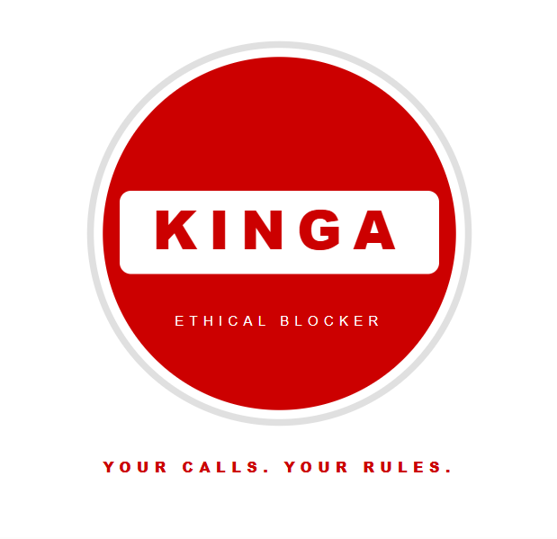

# Kinga | Ethical Blocker

  

## What is Kinga?

Kinga is a smart unsolicited call blocker built for one simple reason:
you shouldn't have to pick up every unknown call just because you're
waiting for something important.

Kinga detects unsolicited marketing calls before they reach you,
tells you why it blocked them, and learns from every call it catches.

## The problem

When you're actively job searching you pick up everything.
Every unknown number could be the call that changes things.
Marketing callers know this and they take advantage of it.

Your time gets wasted. Your focus gets broken.
And you can't just stop answering because what if it's real?

Kinga gives you back that choice.

## The difference

There's nothing wrong with insurance, telecoms, or energy providers.
The problem is when they call you without invitation.

Unsolicited means you didn't ask. You didn't sign up.
You didn't give permission.

That's what Kinga blocks. Not the category. The intrusion.

## How it works

- Incoming call detected
- Kinga checks the number against known patterns and databases
- If unsolicited marketing: call blocked automatically
- You see a notification: "Kinga blocked this call | Category: Insurance"
- Number saved to your personal block list for next time
- Built-in override because no system is perfect and you always
  have the final say

## Features (v0.1)

- Automatic unsolicited call detection
- Category identification before blocking:
  - Insurance
  - Telecom / Phone offers
  - Hearing aids / Medical devices
  - Energy providers
  - Prize / Contest scams
  - Automotive
  - Other unsolicited
- Personal block list that grows smarter over time
- One-tap override. Final decision is always yours
- False positive protection — whitelist any number instantly
- No data sold. Ever.

## Principles

- Your calls. Your rules.
- Block with context not just silence
- Smart enough to protect you. Humble enough to let you decide.
- Ethical by design. Private by default.

## Current stage

- concept definition
- initial documentation
- Python prototype in progress

## Next steps

- build number detection logic in Python
- integrate spam number database API
- add category classification
- build notification system
- explore Android/iOS implementation

## Vision

A world where your phone works for you.
Not for whoever decided to call you today.

## Philosophy

You shouldn't have to fight for your own attention.

Kinga is built on one belief: your time and focus are yours.
Not the insurance company's. Not the telecom's.
Not anyone who decided today was a good day to interrupt you.

The categories Kinga blocks aren't bad in themselves.
Insurance matters. Energy matters. Healthcare matters.
What doesn't matter is being called without asking for it.

Block with context. Decide with clarity. Stay in control.
Your phone should protect your peace not disturb it.

## Personal note

Kinga was born from two things: frustration and an unexpected
conversation.

The frustration is personal and universal at the same time.
Me: forced to answer every unknown call during a job search
because missing the important one wasn't an option.
My family: constantly pestered by marketing calls, irritated
every single time the phone rings for no good reason.

Sound familiar? Because it probably does.

Marketing callers exploit the fact that you can't afford to
ignore your phone. Kinga was built to close that gap.

The unexpected part: someone who didn't need Kinga helped me
realize others definitely would. Sometimes the best product
ideas come from the person who says "that's not for me, but..."

Unsolicited? Your calls. Your rules.

*Kinga. Brave enough to fight the battles you shouldn't have to.*
